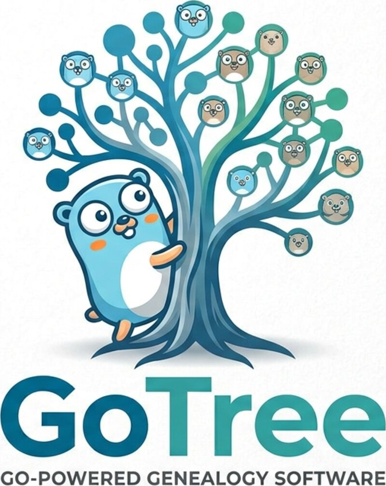

<p align="center">
  
</p>

# GoTree

A lightweight, self-hosted family tree app. One Go binary with an embedded React UI and a single
SQLite file — no database server, no cloud account.

**Status:** early development.

## Planned features

- People, families, events, places, sources and citations
- Photos and documents attached to people and events
- Pedigree, descendant, hourglass and family-group views with pan & zoom
- GEDCOM 5.5.1 and 7.0 import and export
- Relationship calculator ("how is A related to B?")
- Single user today, data model ready for multiple users and trees

## Stack

- Backend: Go, chi, SQLite (`modernc.org/sqlite`, no CGO), goose, sqlc
- Frontend: React, TypeScript, Vite, Tailwind CSS, React Flow
- Deployment: single binary (`go:embed`) or Docker image (`ghcr.io/praetorianer777/gotree`)

## Running

```bash
docker run -d -p 8080:8080 -v gotree-data:/data ghcr.io/praetorianer777/gotree
```

or download a binary from the releases page and run `./gotree`. Open http://localhost:8080.

| Setting | Flag | Environment | Default |
|---|---|---|---|
| Data directory (database, media) | `-data-dir` | `GOTREE_DATA_DIR` | `./data` (`/data` in Docker) |
| Listen address | `-listen` | `GOTREE_LISTEN_ADDR` | `:8080` |
| First admin account (only used while there is none) | | `GOTREE_ADMIN_USER`, `GOTREE_ADMIN_PASSWORD` | `admin`, unset |
| Largest upload (MB) | | `GOTREE_MAX_UPLOAD_MB` | `100` |

On first start GoTree asks you in the browser to create the admin account and name your tree.
For unattended installs, set `GOTREE_ADMIN_PASSWORD` instead.

Behind a reverse proxy, terminate TLS there and forward `X-Forwarded-Proto: https` so the session
cookie is marked secure. Failed logins are throttled per client address; GoTree sees the proxy's
address, so the limit then applies to all clients together.

Behind a reverse proxy, allow request bodies as large as the upload limit.

### Backup and restore

Everything lives in the data directory: the database `gotree.db` and `media/` with the uploaded
files. Administrators can download both as one zip under **Import & export → Backup**; the
database in it is a consistent snapshot taken while GoTree keeps running. Copying the data
directory works too, but only while GoTree is stopped, since the database may have changes in
its `-wal` file that a copy taken mid-write would miss.

To restore, stop GoTree, unzip the backup into an empty data directory (so that `gotree.db` and
`media/` sit directly in it) and start GoTree again. Thumbnails are not in the backup; they are
made again when first shown.

## Development

Requires Go and Node.js (LTS).

```bash
make dev     # API on :8080, Vite on :5173 with hot reload (proxies /api)
make build   # frontend + single binary ./gotree
make test    # ./run-tests.sh — the same gate the pre-push hook and CI use
```

The end-to-end tests (`web/e2e`, Playwright) use the installed Chrome or Chromium; set
`CHROME_PATH` if it is not found in the usual places.

Layout: `cmd/gotree` (entry point), `internal/` (`config`, `db` + migrations, `gendate` GEDCOM
dates, `store` domain logic, `api` HTTP handlers), `web/` (React app, embedded into the binary
via `web/embed.go`).

## Releasing

`./release.sh` derives the next version from the Conventional Commits since the last tag, moves
the `[Unreleased]` section of `CHANGELOG.md` into the release, updates `VERSION`, commits and
tags. `./release.sh --dry-run` shows what it would do. Pushing the tag
(`git push origin main --follow-tags`) triggers the release workflow, which publishes binaries
for Linux, macOS and Windows and a multi-arch Docker image.

## License

[AGPL-3.0](LICENSE)

The logo builds on the Go gopher, designed by [Renée French](https://reneefrench.blogspot.com/) and
licensed under [CC BY 4.0](https://creativecommons.org/licenses/by/4.0/).
